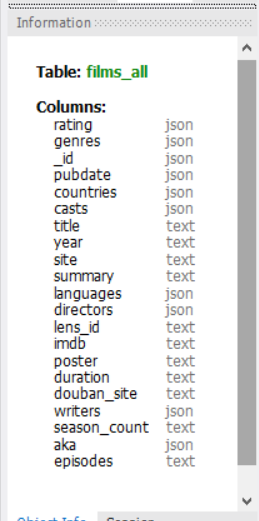
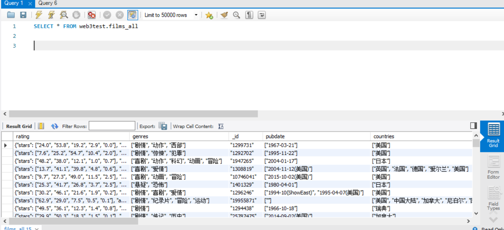
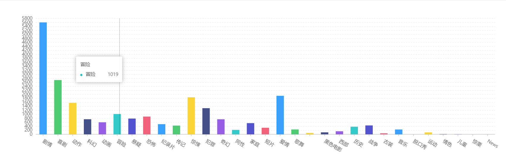
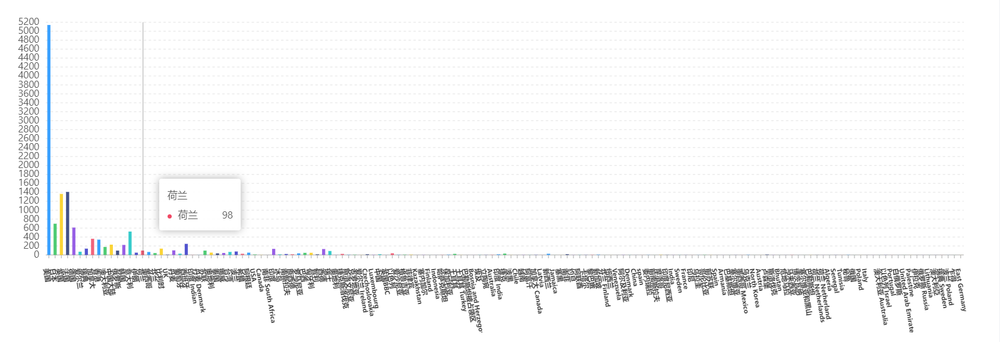
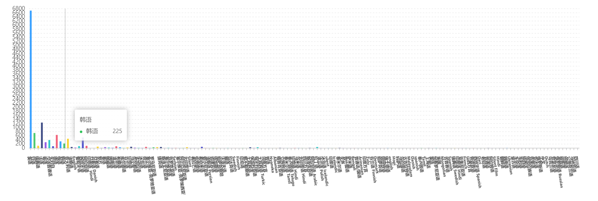

**web课程第三次作业**

页面链接：<https://mooooon333.github.io/web_lab2_movie-list/>

github地址：<https://github.com/mooooon333/web_lab2_movie-list>

**由于此次主要功能和上次作业一样，主要变化在于数据量的增大和加入后端和数据库的交互，不再制作专门的gif图，功能呈现的gif图仍使用上次的，请查看image文件夹**

### 技术栈

前端采用react，组件采用ant design，可视化图标使用了bizcharts。使用异步请求fetch函数向后端请求数据。

后端使用python语言，使用flask框架，数据库使用mysql，flask使用pymysql连接数据库进行查询。

数据库






共有10000行数据


### 电影主列表

由于此次电影的数据量较大，不同于上次作业，一次加载的时间太长，所以本次采用分页加载，即每次只获取获取一页的内容（每页10个电影，共有1000页）。每次换页时，分页组件的回调函数就会向重新向后端fetch相应页的数据，flask向数据库查询时通过使用`select * from tablename limit row,offset `实现

#### 后端相关代码

路由设置

```python
@app.route('/api/films/<page>')
def get_page(page):
    db = Database()
    page = int(page)
    start = page * 10 - 10
    # start表示每回开始取的位置，比如第10页从第90项开始，每页取10项
    one_page_film = db.list_one_page(start)
    return jsonify(one_page_film)
```

 database类里的查询函数

```python
def list_one_page(self, start):
    sql = "SELECT * FROM web3test.films_all limit %s,10 "
    self.cur.execute(sql, start)
    result = self.cur.fetchall()
    return result
```

#### 前端相关代码

从代码中可以看出，在渲染之前先fetch到第一页的内容。由于异步的缘故，要在then里用setState才能成功渲染。(handleJson为使用JSON.parse函数去解析嵌套的json数据)

```javascript
componentWillMount() {
    this.fetchData(1)
}

fetchData(page) {
    fetch(webBase+'/api/films/'+page)
        .then(res => res.json())
        .then(json =>  {
            addjson = json;
            this.handleJson();
            this.setState({
                data: addjson,
            });
        });
}
```

分页组件的每一页的按钮回调函数里也会调用fetchData函数

```js
pagination={{
               onChange: (page) => {
               							...
                                        this.fetchData(page);
                   						...
                                    
```

### 搜索功能

搜索功能一共有三项，按标题搜索，按类别搜索，以及全文搜索。其他搜索的实现思路也基本一样，不再重复实现。这里只简单介绍按类别搜索的实现。

后端实现基本与主列表的思路相同，但是搜索的话一个问题是搜索后总页数就改变了，所以在渲染具体内容前先在数据库里获取结果总共有多少行，返回到前端来重新渲染分页组件的页数，state里有pageNum属性。（由于限制速度的主要原因是大数据量的传输，而数据库查询在10000条数据的情况下仍然十分快，所以这里不会降低速度。）

后端获取搜索某类电影的结果的总数

```python
    def genre_num(self, genre):
        sql ="select _id from web3test.films_all where genres like %s"
        result = self.cur.execute(sql, "%"+genre+"%")
        return str(result)
```

而后端分页获取内容与总列表基本思路一样，只是查询语句改变（如上），所以这里不再赘述。

主要是前端要进行一定的设置，因为分页组件的回调函数必须知道当前列表的内容，是主列表呢？还是按类别后的列表？还是按标题搜索后的列表？搜索的内容也要记录在state里，这样分页组件的每一页按钮的回调函数才能根据此时的列表内容和state里的搜索内容去后端fetch相应的数据。

这里看完整的分页组件的回调函数就能理解,listContent为空表示主列表，剩下三个分别表示按类别搜索，按标题搜索和全文搜索。state里相应属性存着搜索内容。

```javascript
pagination={{
	onChange: (page) => {
		if(this.state.listContent === "") {
			this.fetchData(page);
		} else if(this.state.listContent === "genre") {
			this.fetchGenreData(this.state.genre, page);
		} else if(this.state.listContent === "title") {
			this.fetchTitleData(this.state.title, page);
		}else if(this.state.listContent === "all") {
             this.fetchAllData(this.state.all, page);
        }},
...
}}
```

按标题搜索基本上实现完全一样，全文搜索支持_id，genres,countries,title,summary,languages,director,writers,aka,casts共十个属性。

按类别浏览也相当于间接调用按类别搜索来实现，就不再专门介绍了。

### 电影详情

切换到详情页面时，通过路由传参

```javascript
<Route path = "/detail/:id" component={Detail} />
```
detail页面通过id去后端获取响应电影信息
```javascript
fetch(webBase+'/api/id/'+this.props.match.params.id)
```

获取后进行处理，处理的相关代码请查看源码。

### 数据可视化

数据可视化为了更好地体现功能实现，并没有提前分析好后展现，而是访问charts页面时实时去数据库fetch数据后处理。由于电影量较大，所以加载速度相对比较慢。鼠标移动到响应列可以查看看不清的横轴坐标值。

有按类别，按国家和按语言统计，由于一部电影可能同时属于几个类别，在几个国家上映，也有多种发行语言。所以总数是不等于10000的。







后端代码还是以类别的统计为例

```python
@app.route('/api/genre/all')
def get_all_genre():
    db = Database()
    return jsonify(db.all_genre())
```
all_genre实现：
```python
    def all_genre(self):
        sql ="select genres from web3test.films_all"
        self.cur.execute(sql)
        result = self.cur.fetchall()
        return result
```

前端向后端获取所有行genres属性后，进行遍历，统计处理，类别统计的相关处理函数为`genreAnalyze`。国家和语言统计的命名风格都类似。处理后setState后通过Bizcharts的柱状图组件渲染。
