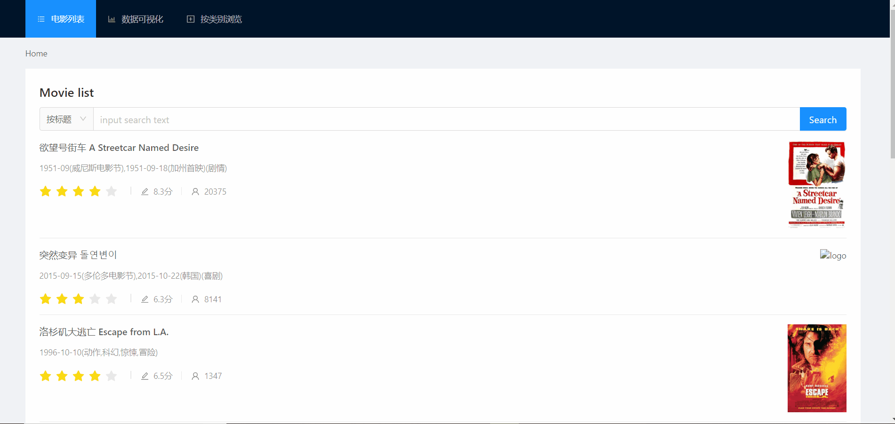
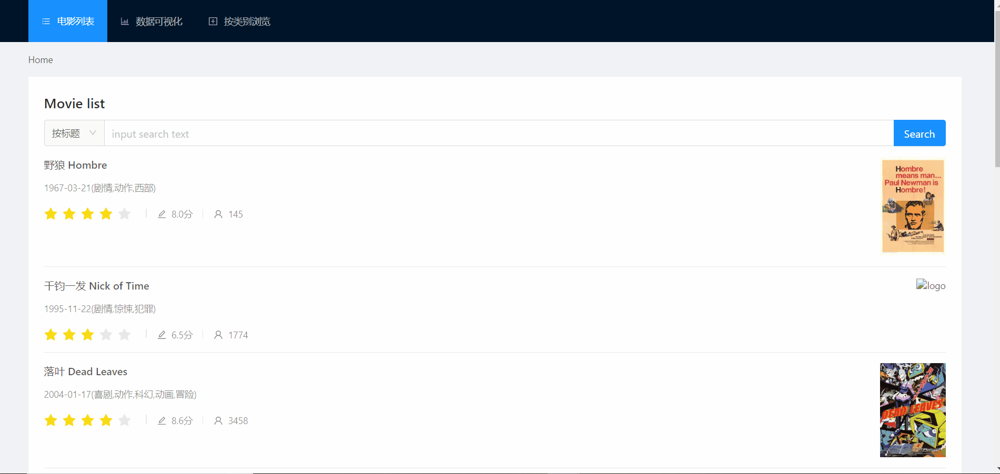

# Movie-List

同济大学软件学院web课程第二次作业

1652613白皓月

页面链接：<https://mooooon333.github.io/web_lab2_movie-list/>

github地址：<<https://github.com/mooooon333/web_lab2_movie-list>>

## 作业简介

实现一个简易的电影列表web页面，并使用JavaScript实现一些交互功能。

## 完成情况

- 使用JavaScript解析films.json文件，并
  将解析后的内容动态生成为html元素，以列表的形式展示在网页中；
- 实现了分页功能；

- 布局合理简介美观；
- 实现电影详情页，点击电影名可以实现跳转

- 实现了搜索功能
  - 按标题

  - 按类别

  - 全文搜索

- 数据统计及可视化
  - 按类别统计并生成可视化图表
  - 按国家统计并生成可视化图表
  - 按语言统计并生成可视化图表

- 加入按类别浏览的菜单项

